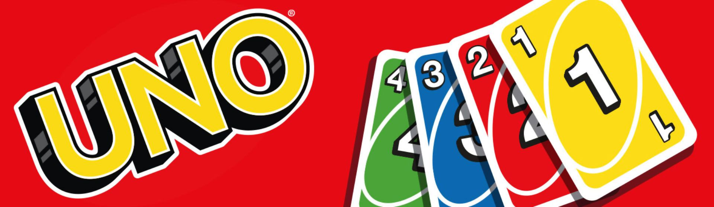
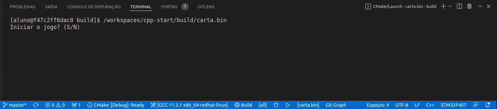
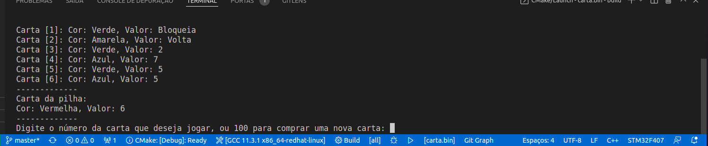

<h1 align="center">
    
</h1>

## **UNO CARDS**

#### 📌 **INDICE**

1.  [SOBRE](#📋-sobre)
2.  [TECNOLOGIAS UTILIZADAS](#💻-tecnologias-utilizadas)
3.  [DETALHES DA IMPLEMENTAÇÃO](#🎯-detalhes-da-implementação)
4.  [REGRAS DO JOGO](#🕹-regras-do-jogo)
5.  [COMO BAIXAR](#📥-como-baixar)

___

#### 📋 **SOBRE**

<p align="justify">
O projeto **UNO cards** é uma simulação  do jogo original  *UNO* ™ jogo de cartas estadunidense, desenvolvido por Merle Robbins e familiares (com a participação de Samuel Sosthenes) em 1971. Uno é um dos jogos de cartas mais famosos e mais vendidos no mundo todo.
</p>

<p align="justify">
Há muitas versões Uno para dispositivos móveis. Neste caso foi desenvolvido dentro da Matéria de Programação III do curso de Engenharia Mecatrônica na UFSC CTJ, como o intuito de colocarmos em prática todo o conteúdo estudado durante o decorrer do semestre.
</p>
___

#### 💻 **TECNOLOGIAS UTILIZADAS**

O projeto foi desenvolvido utilizandos as seguintes tecnologias:

- [C++ 17](https://en.cppreference.com/w/cpp/17)
- [CMake](https://cmake.org/)
- [Github](https://github.com/)
___

#### 📥 **COMO BAIXAR**] 

```bash
# Para ter acesso ao projeto, basta clonar o repositório [de preferência para a utilização do compilador GCC 11.3.1 x86_64-redhat-linux]

    $ git clone http://github.com/geisniwander/uno

```

```bash
# Entrar no diretorio

    $ cd uno
```

```bash
#Executar o Yarn install

    $ yarn install

```


```bash
# Iniciar o projeto

    $ yarn start

```
___

#### 🕹 **REGRAS DO JOGO**

<p align="justify">
O baralho é composto por cartas de quatro
cores:

>  🟦 azul <br>
>  🟨 amarela <br>
>  🟩 verde <br>
>  🟥 vermelha <br>
> ⬛ preta <br>

Contendo 20 cartas de cada cor.
</p>

<p align="justify">

As fileiras de cada cor variam entre 0 e 9. Existem três ações especiais para cada tipo de cor de carta, identificadas como "Bloqueia" **(∅)**, "Compra duas" **(2+)** e "Inverter" **(↔)**. 

- **(∅)** "Bloqueia": 2 cartas de cada cor
- **(2+)** "Compra duas": 2 cartas de cada
- **(↔)** "Inverter": 2 cartas de cada cor cor

Há também cartas de ações especiais com fundo preto, "Muda de cor" **(⊞)** e "Compra quatro" **(4+)**.

- **(⊞)** "Joker": 4 cartas
- **(4+)** "Compra quatro": 4 cartas

___

| CARTA    |  AÇÃO  | DESCRIÇÃO |
  :---:  |  :---  |  :---
**(∅)** |<p align="justify"> A carta "Bloqueia" cancela a jogada do próximo jogador.</p>|<p align="justify"> Se o jogador 1 joga a carta "Bloqueia" **(∅)**, o jogador 2 perde a vez e o jogador 1 joga novamente.</p>
**(2+)**|<p align="justify"> O próximo jogador compra duas cartas e perde a sua vez de jogar.</p> | <p> Caso tenha mais de uma no baralho do jogador que está na vez, pode ser jogadas em sequência </p> 
**(↔)** |<p align="justify"> A ordem do jogo é invertida do sentido horário para o sentido anti-horário e vice-versa. Se o jogo for jogado por duas pessoas, a carta é tratada com o mesmo sentido de "Bloquear".</p>|<p align="justify"> Se a carta "Inverte" é jogada não acontece nada pois são apenas dois jogadores. Nesse caso o jogo continua normalmente.</p>
**(⊞)** |<p align="justify"> O jogador escolhe qual deve ser a cor para prosseguir o jogo.</p>|<p align="justify"> Esta carta pode ser jogada a qualquer momento do jogo, mesmo se o jogador tiver outra carta para usar.</p>
**(4+)**|<p align="justify"> O jogador escolhe qual deve ser a cor para prosseguir o jogo, além de fazer o próximo jogador comprar quatro cartas e perder sua vez de jogar.</p>|<p align="justify"> Esta carta só deve ser jogada quando a pessoa não possuir outra para jogar, senão pode ser penalizada.</p>
___

Para Iniciar o jogo, é necessário escolher a ação S/N no menu:

<h1 align="center">
     
</h1>

 Quando o jogo inicia o sistema gera o baralho de jogo e sorteia 2 baralhos de jogador com 7 cartas cada, o jogo sempre começa com o jogador 1.

 Na tela, irá aparecer as informações de qual jogador é a vez, também, as cartas que ele têm e a carta que esta na pilha.
 > *OBS:* 
 O jogador tem que escolher uma carta do baralho dele que tenha as mesmas caracteristicas da carta da pilha, seja o número, a cor, ou a carta de "ação".

 Para selecionar a carta a ser jogada, o jogador tem que digitar apenas o número que aparece entre colchetes **[]** antes de cada carta.

<h1 align="center">
    
</h1>

Caso o jogador *não tenha* uma carta com as caraterísticas necessárias, ele pode comprar uma nova digitando o número **100** até uma carta do tipo aparecer.

Quando as cartas de **+2** ou **+4** são jogadas, as cartas são compradas automaticamente no baralho do jogador oponente.

Caso o jogador jogue a carta "Muda de cor", deve-se digitar a o número da cor a ser trocada.

E por fim, jogo acaba quando um dos jogadores não tiver mais cartas em seu baralho.

 👾 **GAME OVER** 👾
</p>

___

### **Desenvolvido por:**

> * Geisniwander Pelegrini Santos () - Engenharia Mecatrônica (UFSC CTJ) <br>
> * Gabriella Arévalo Marques (21204244) - Engenharia Mecatrônica (UFSC CTJ)
